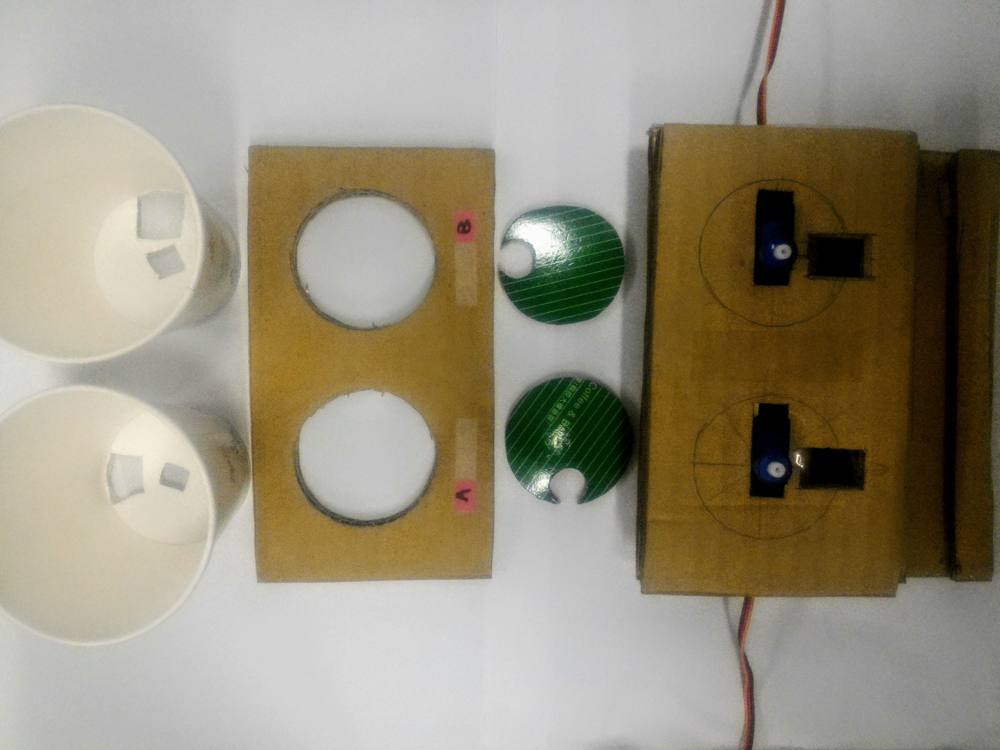

# What is Facial Recognizing Drug Dispenser
Facial Recognizing Drug Dispenser is a smart drug dispensing system which allows patients to get the pills they have to take via face recognizing technique and enables healthcare professionals to dynamically config prescriptions for each of their patients.

# How we make it
## 0. Overview
[Web page for our project](https://ntuee-eslab.github.io/2017Fall-smart-pill-dispenser)

p.s. In project demo we use MM chocolate beans to represent real pills.
## 1. App
### Main function
Caregivers can set patient's personal information and prescription in our mobile app easily through an interactive chatroom.


|Login Screen                          | Device Menu                        | Chatroom                           |
|--------------------------------------|------------------------------------|------------------------------------|
 ||||

### How to use it
a. Required packages:
  - [Node.js](https://nodejs.org/en/)
  - [React Native](https://facebook.github.io/react-native/)

b. Usage:
  - installation:
```
cd client/app && npm install
```
  - start the simulator (run-ios for iOS or run-android for Android):
```
react-native run-{ios,android}
```

## 2. Raspberry Pi
### Main function
An Raspberry Pi is used to recognize patients(by sending photos to the remote server where facial recognition is performed), fetch user prescription from server and send drug delivery signals to Arduino.
### How to use it
#### 1. Node.js Client
a. Required packages:
  - [Node.js](https://nodejs.org/en/)

b. Usage:
  - installation:
```
cd pi && npm install
```
  - start serving:
```
cd pi && node client.js
```
#### 2. Python PiCamera Server
a. Required packages:
  - python 3.4+
  - picamera
  - smbus

b. usage:
```
cd pi &&  python3 camera-server.py
```
## 3. Server
### Main function
A remote server is responsible for facial recognition and data storage. Our server receives photos taken by a Raspberry Pi, identify who is taking the medicine, then returns the corresponding prescription fetched from database to Raspberry Pi.
### How to use it
#### 1. face recognition
a. Required packages:
  - Python 3.4+
  - [OpenCV](https://opencv.org/) 3+ (with python3 bindings) and [opencv_contrib](https://github.com/opencv/opencv_contrib) for [FaceRecognizer](https://docs.opencv.org/3.0-beta/modules/face/doc/facerec/index.html)
  - [dlib](https://github.com/davisking/dlib) for face alignment

b. Usage:

```
cd server/face_recognizer && python3 server.py --predictor_path [path to predictor] --gallery_path [path_to_gallery]
```
`predictor_path` is the folder where `shape_predictor_68_face_landmarks.dat` is located;

`gallery_path` is where patients' aligned and cropped faces will be stored. You can also put your preprocessed faces here in `[gallery_path]/[patient name]`.
#### 2. app server
a. Required packages:
  - [Node.js](https://nodejs.org/en/)
  - [MongoDB](https://www.mongodb.com/)

b. Usage:
  - installation:
```
npm install
```
  - start serving:
```
npm start
```

## 4. Arduino
### Main function
The Arduino drives dispenser(s) to dispense drugs with specified number and types after receiving drug-dispensing requests from Rpi. 
### How to use it
#### 1. Connect the pins between Arduino and Rpi
We use I2C to connect Arduino and Rpi, so
#### 2. Connect the pins between Arduino and dispenser(s) 
Folling [this tutorial](http://yehnan.blogspot.tw/2013/09/arduinotower-pro-sg90.html) of SG-90, connect the signal pin, 5V pin, and the GND pin between the Arduino and the dispenser.

In our project we use the digital pin 9 as the signal pin of dispenser A; the digital pin 10 as the signal pin of dispenser B
#### 3. Upload the code to Arduino
Upload the code in "arduino.ino" to Arduino.
#### 4. Check the functionality of Arduino from Rpi side
With Arduino on, run "i2c-pi-arduino_test.py" in Rpi, and input the numbers of drug A and drug B respectively. You can thus check whether Arduino receive the correct values from the screen output.
## 5. Dispenser(s) with SG-90 servo motor(s)
### Main function
Each time when the dispenser is called by Arduino, it uses its servo motor SG-90 to rotate the round disk on the bottom of its cup by shaking it back and forth continuously( [see this demo video](https://drive.google.com/file/d/12Qg_4VxAPz-3_LBOeaAZ1OhXzHrLSbA5jA/view)), make one pill pass the hole of its cup, and thus finish dispensing one pill of drug.

### How to use it
#### 1. Assembly all components in **the picture in Main function section** together and you will see the whole structure like this:


# Results 
[Introducing our drug dispenser](https://www.youtube.com/watch?v=pqof2ZdDoas)

[The operation of drug dispenser](https://photos.app.goo.gl/EeoVgY1gCzidloPn2)

# References
1. [OpenCV Face Recognizer API](https://docs.opencv.org/3.0-beta/modules/face/doc/facerec/index.html)